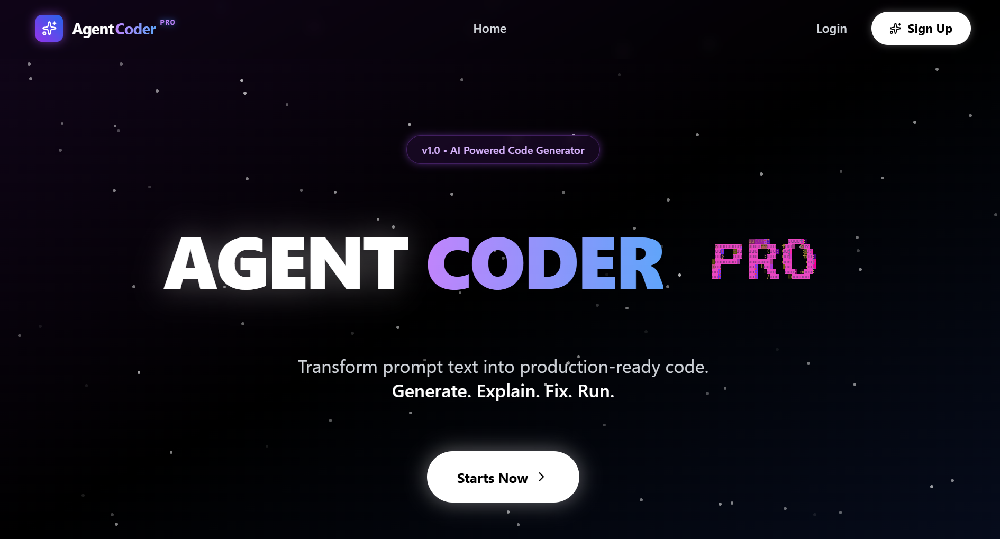
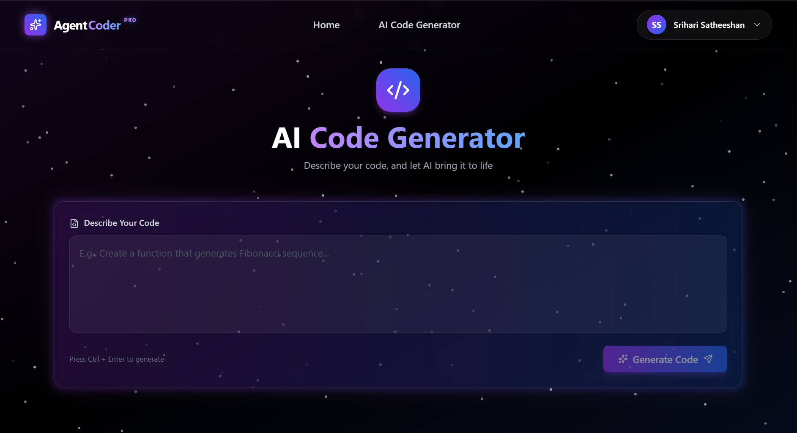
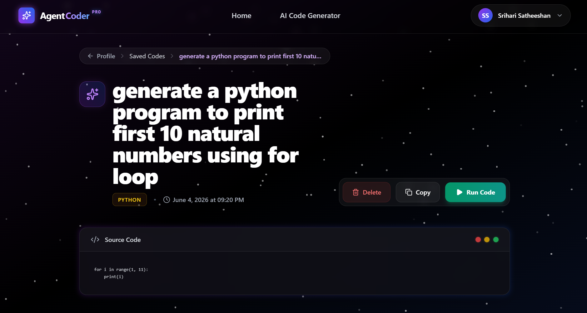
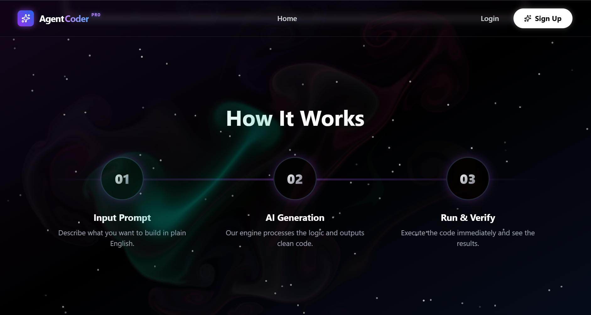
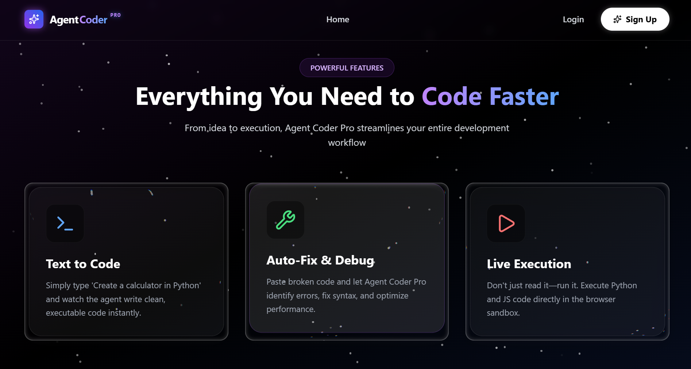
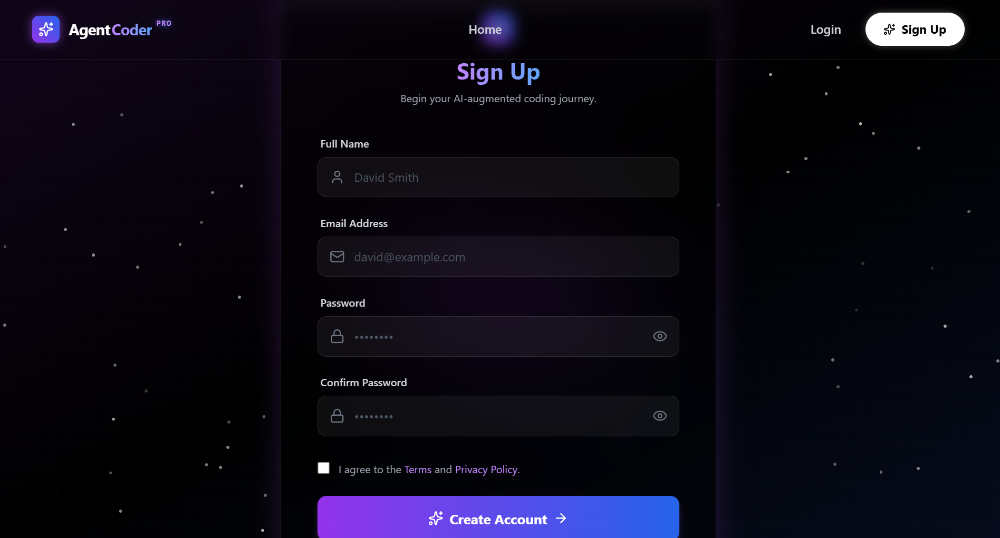
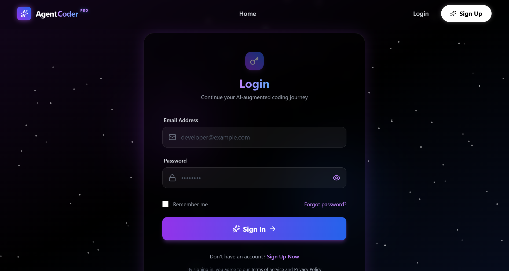
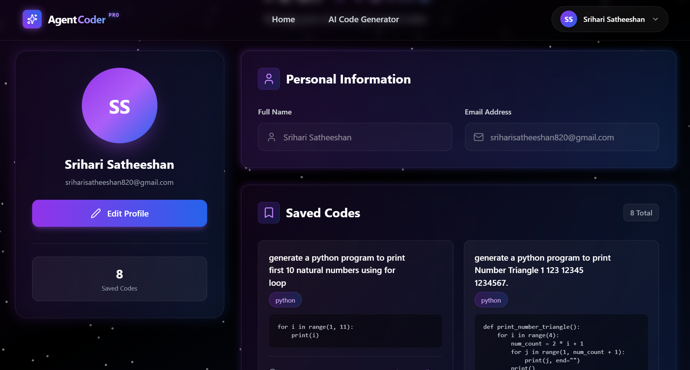

<p align="center">
  
  
  
  
  
  
</p>

<br />

<div align="center">
  <pre style="font-size: 28px; font-weight: bold; color: #a855f7; background: #000; padding: 20px; border-radius: 16px; border: 1px solid #333;">
    █████╗  ██████╗ ███████╗███╗   ██╗████████╗
    ██╔══██╗██╔════╝ ██╔════╝████╗  ██║╚══██╔══╝
    ███████║██║  ███╗█████╗  ██╔██╗ ██║   ██║
    ██╔══██║██║   ██║██╔══╝  ██║╚██╗██║   ██║
    ██║  ██║╚██████╔╝███████╗██║ ╚████║   ██║
    ╚═╝  ╚═╝ ╚═════╝ ╚══════╝╚═╝  ╚═══╝   ╚═╝
  </pre>
  
  <pre style="font-size: 18px; color: #38bdf8; background: #000; padding: 10px; border-radius: 8px; border: 1px solid #2563eb;">
    ██████╗ ██████╗ ██████╗ ███████╗██████╗
    ██╔════╝██╔═══██╗██╔══██╗██╔════╝██╔══██╗
    ██║     ██║   ██║██████╔╝█████╗  ██████╔╝
    ██║     ██║   ██║██╔══██╗██╔══╝  ██╔══██╗
    ╚██████╗╚██████╔╝██║  ██║███████╗██║  ██║
     ╚═════╝ ╚═════╝ ╚═╝  ╚═╝╚══════╝╚═╝  ╚═╝
  </pre>

  <pre style="font-size: 28px; font-weight: bold; background: linear-gradient(90deg, #a855f7, #3b82f6); -webkit-background-clip: text; color: transparent; padding: 10px;">
██████╗ ██████╗  ██████╗
██╔══██╗██╔══██╗██╔═══██╗
██████╔╝██████╔╝██║   ██║
██╔═══╝ ██╔══██╗██║   ██║
██║     ██║  ██║╚██████╔╝
╚═╝     ╚═╝  ╚═╝ ╚═════╝
  </pre>
</div>

<br />

<p align="center">
  <strong>Transform natural language into production-ready code in seconds.</strong>
  <br />
  <em>Generate. Explain. Fix. Run.</em>
</p>

<br />

<p align="center">
  <a href="features">Features</a> •
  <a href="tech-stack">Tech Stack</a> •
  <a href="quick-start">Quick Start</a> •
  <a href="api-endpoints">API</a> •
  <a href="deployment">Deploy</a> •
  <a href="contributing">Contribute</a>
</p>

<br />

---

## ✦ Overview

**Agent Coder Pro** is a state-of-the-art AI development environment that converts plain English prompts into clean, executable code. Powered by advanced LLMs (Hugging Face + Gemini), it supports **Python, JavaScript, C++, and C** — all wrapped in an immersive cosmic-themed UI.

```
💬 "Create a calculator in Python"   →   🧠 AI Processing   →   ⚡ Executable Code
```

---

## ✦ Features

<div align="center">

|     | Feature              | What It Does                                                         |
| --- | -------------------- | -------------------------------------------------------------------- |
| 💬  | **Text to Code**     | Describe what you want in plain English — get working code instantly |
| 🔧  | **Auto-Fix & Debug** | Paste broken code; AI identifies errors, fixes syntax, and optimizes |
| ▶️  | **Live Execution**   | Run Python, JS, C++, and C directly in a secure browser sandbox      |
| 📖  | **Code Explanation** | Get step-by-step natural language breakdowns of any code             |
| ⚡  | **Streaming Output** | Watch AI responses appear character-by-character in real time        |
| 💾  | **Save & Manage**    | Persist generated code to your profile for later access              |
| 🔐  | **Auth System**      | JWT-based login/signup with OTP password recovery via email          |
| 🌌  | **Cosmic UI**        | Galaxy animations, glassmorphism, splash cursor, ASCII text effects  |

</div>

---

## ✦ Tech Stack

<div align="center">

### Frontend

|     | Technology          | Purpose                  |
| --- | ------------------- | ------------------------ |
| ⚛️  | **React 19**        | UI library               |
| ⚡  | **Vite**            | Build tool & dev server  |
| 🎨  | **Tailwind CSS 3**  | Utility-first styling    |
| 🌀  | **Framer Motion**   | Animations & transitions |
| 🧭  | **React Router v7** | Client-side routing      |
| 🎭  | **Lucide React**    | Icon library             |
| 🎬  | **GSAP**            | Advanced animations      |
| 🎲  | **Three.js**        | 3D rendering             |

### Backend & Database

|     | Technology             | Purpose              |
| --- | ---------------------- | -------------------- |
| 🟢  | **Node.js + Express**  | Server framework     |
| 🍃  | **MongoDB + Mongoose** | Database & ODM       |
| 🔑  | **JWT + bcrypt**       | Authentication       |
| 📧  | **Nodemailer**         | Email (OTP, welcome) |
| 🛡️  | **Helmet**             | Security headers     |
| ⏱️  | **express-rate-limit** | Rate limiting        |

### AI & APIs

|     | Service                             | Usage                        |
| --- | ----------------------------------- | ---------------------------- |
| 🤗  | **Hugging Face** (Kimi-K2-Thinking) | Code generation              |
| 🌟  | **Google Gemini 2.5 Flash**         | Code explanation & debugging |

</div>

---

## ✦ Screenshots

<table>
  <tr>
    <td align="center"><strong>🏠 Home Page</strong></td>
    <td align="center"><strong>⚡ Code Generator</strong></td>
    <td align="center"><strong>💾 Saved Code</strong></td>
  </tr>
  <tr>
    <td></td>
    <td></td>
    <td></td>
  </tr>
  <tr>
    <td align="center"><strong>🏠 Home — Hero</strong></td>
    <td align="center"><strong>🏠 Home — Features</strong></td>
    <td align="center"><strong>🔐 Signup</strong></td>
  </tr>
  <tr>
    <td></td>
    <td></td>
    <td></td>
  </tr>
  <tr>
    <td align="center"><strong>🔐 Login</strong></td>
    <td align="center"><strong>👤 Profile</strong></td>
    <td align="center"><strong>📂 Saved Code Detail</strong></td>
  </tr>
  <tr>
    <td></td>
    <td></td>
    <td></td>
  </tr>
</table>

---

## ✦ Architecture

```
┌─────────────────────────────────────────────────────┐
│                  CLIENT (Vite + React)               │
│                                                      │
│  ┌───────────┐  ┌───────────┐  ┌────────────────┐   │
│  │   Pages   │  │Components │  │    Utils       │   │
│  │  Home     │  │  Navbar   │  │ formatResponse │   │
│  │  Codegen  │  │  Footer   │  └────────────────┘   │
│  │  Auth     │  │  Galaxy   │                        │
│  │  Profile  │  │  Glass    │                        │
│  └─────┬─────┘  └─────┬─────┘                        │
│        └────── HTTP ───┘                             │
└──────────────────┬──────────────────────────────────┘
                   │
┌──────────────────▼──────────────────────────────────┐
│                  SERVER (Express.js)                  │
│                                                      │
│  ┌──────────┐  ┌──────────┐  ┌──────────────────┐   │
│  │   Auth   │  │ Generate │  │   Code Run       │   │
│  │  Routes  │  │  Routes  │  │   Routes         │   │
│  └──────────┘  └──────────┘  └──────────────────┘   │
│         │            │               │               │
│  ┌──────▼────────────▼───────────────▼────────────┐  │
│  │              MongoDB (Mongoose)                 │  │
│  └────────────────────────────────────────────────┘  │
└──────────────────────────────────────────────────────┘
```

---

## ✦ Quick Start

### Prerequisites

```bash
node >= 18
npm >= 9
mongodb (local or Atlas)
python3         # for Python execution
g++ / gcc       # for C++ / C execution
```

### Installation

```bash
# Clone
git clone https://github.com/harysri/agent-coder-pro.git
cd agent-coder-pro

# Install dependencies
cd client && npm install
cd ../server && npm install
```

### Environment Variables

Create `server/.env`:

```env
PORT=5000
MONGODB_URI=mongodb+srv://<user>:<pass>@cluster.mongodb.net/agentcoder
JWT_SECRET=your_super_secret_key
HF_API_KEY=hf_your_huggingface_key
GEMINI_API_KEY=your_gemini_key
EMAIL_USER=your@gmail.com
EMAIL_APP_PASSWORD=your_gmail_app_password
```

### Run Development Servers

```bash
# Terminal 1 — Backend
cd server
npm start              # http://localhost:5000

# Terminal 2 — Frontend
cd client
npm run dev            # http://localhost:5173
```

### Production Build

```bash
cd client
npm run build          # Output: client/dist/
```

---

## ✦ Folder Structure

```
agent-coder-pro/
│
├── client/
│   ├── public/
│   ├── src/
│   │   ├── Components/
│   │   │   ├── Navbar.jsx
│   │   │   ├── Footer.jsx
│   │   │   ├── GlassSurface.jsx
│   │   │   ├── SplashCursor.jsx
│   │   │   ├── ASCIIText.jsx
│   │   │   └── ScrollToTop.jsx
│   │   ├── Pages/
│   │   │   ├── Home.jsx
│   │   │   ├── Codegenerator.jsx
│   │   │   ├── Login.jsx
│   │   │   ├── Signup.jsx
│   │   │   ├── Profile.jsx
│   │   │   ├── ForgotPassword.jsx
│   │   │   └── Viewcodedetail.jsx
│   │   ├── Utils/
│   │   │   └── formatResponse.jsx
│   │   ├── App.jsx
│   │   └── main.jsx
│   ├── package.json
│   ├── vite.config.js
│   └── tailwind.config.js
│
├── server/
│   ├── Routes/
│   │   ├── auth.js
│   │   ├── codegeneration.js
│   │   ├── run.js
│   │   └── viewcode.js
│   ├── models/
│   │   └── user.js
│   ├── middlewares/
│   │   └── authenticate.js
│   ├── tmp/
│   ├── index.js
│   └── package.json
│
├── screenshots/
├── README.md
└── .gitignore
```

---

## ✦ API Endpoints

### 🔐 Authentication

```http
POST  /api/auth/signup           # Register
POST  /api/auth/login            # Login
GET   /api/auth/profile          # Get profile  [JWT]
PUT   /api/auth/profile          # Update profile [JWT]
POST  /api/auth/send-otp         # Send reset OTP
POST  /api/auth/verify-otp       # Verify OTP
POST  /api/auth/reset-password   # Reset password
```

### 🤖 AI Code Generation

```http
POST  /api/generate/codegeneration   # Generate code from prompt
POST  /api/generate/explain          # Explain code
POST  /api/generate/debug            # Debug & analyze
```

### ⚡ Code Execution

```http
POST  /api/code/run                  # Run code (Python/JS/C++/C)
```

### 💾 Saved Codes

```http
POST   /api/viewcode/save            # Save code [JWT]
GET    /api/viewcode/my-codes        # List saved [JWT]
GET    /api/viewcode/:codeId         # Get by ID [JWT]
DELETE /api/viewcode/:codeId         # Delete [JWT]
```

---

## ✦ Usage Walkthrough

```
1️⃣  Navigate to Code Generator
2️⃣  Type a prompt (e.g. "Create a Fibonacci function in Python")
3️⃣  Press Ctrl+Enter or click Generate     → Code streams in real time
4️⃣  Click Explain Code                      → Step-by-step breakdown
5️⃣  Click Debug Code                        → Static analysis report
6️⃣  Click Run Code                          → Live execution output
7️⃣  Click Save                              → Persist to your profile
```

---

## ✦ Deployment

| Platform                      | Target   | Notes                          |
| ----------------------------- | -------- | ------------------------------ |
| **Vercel / Netlify**          | Frontend | Deploy `client/dist/`          |
| **Railway / Render / Fly.io** | Backend  | Deploy `server/` with env vars |
| **MongoDB Atlas**             | Database | Cloud-hosted MongoDB           |

---

## ✦ Roadmap

- [ ] Multi-model AI provider selection (OpenAI, Claude, HF)
- [ ] Real-time collaborative editing
- [ ] Downloadable code files (`.py`, `.js`, `.cpp`, `.c`)
- [ ] AI-powered code refactoring
- [ ] Dark/light theme toggle
- [ ] Unit test generation
- [ ] WebSocket live execution logs
- [ ] Role-based access control

---

## ✦ Contributing

1. **Fork** the repo
2. Create a feature branch: `git checkout -b feat/amazing`
3. Commit: `git commit -m "feat: add amazing feature"`
4. Push: `git push origin feat/amazing`
5. Open a **Pull Request**

Please follow existing code conventions and lint rules.

---

## ✦ License

Distributed under the **MIT License**. See [LICENSE](./LICENSE) for details.

---

## ✦ Author

**Agent Coder Pro Team**

- GitHub: [@harysri](https://github.com/harysri)
- Email: support@agentcoder.com
- Project: [https://github.com/harysri/agent-coder-pro](https://github.com/harysri/agent-coder-pro)

---

<p align="center">
  <sub>Built with ❤️ using React, Express, MongoDB & AI</sub>
  <br />
  <sub>⭐ Star this repo if you find it useful!</sub>
</p>
